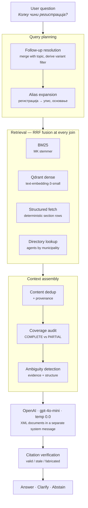

# ЦРМ Агент — Retrieval-Augmented Assistant for the Central Registry of North Macedonia

A production-grade RAG system over the e-services documentation of the **Central
Registry of the Republic of North Macedonia** (Централен регистар на РСМ).

It answers citizens' questions about registering a company, filing an annual
account, registering a pledge, obtaining certificates, fees, deadlines and
required documents — in Macedonian, with a citation on every factual claim.

The hard part of this domain is not retrieval volume. It is that **the same
service has different correct answers depending on a variable the user rarely
states**: registering an АД is free, registering a Фондација costs 2,452 МКД,
and the required-documents list differs across all nine legal forms. A system
that answers confidently without resolving that variable is not helpful — it is
wrong in a way the reader cannot detect.

Everything below exists to make that failure mode measurable and then rare.

---

## Table of Contents

- [Design principles](#design-principles)
- [Architecture](#architecture)
- [Core features](#core-features)
- [Measured results](#measured-results)
- [Quick start](#quick-start)
- [Repository layout](#repository-layout)
- [Evaluation harness](#evaluation-harness)
- [Roadmap](#roadmap)
- [Tech stack](#tech-stack)
- [Known limitations](#known-limitations)

---

## Design principles

**1. An unanswerable question must fail loudly, not quietly.**
Stale gold, a fabricated citation, a corpus block that no longer parses — each
aborts a build or raises a warning rather than silently scoring zero. A retrieval
miss and a broken index must never look the same.

**2. Grounded is not the same as complete.**
The most dangerous output this system produced during development was not a
hallucination. It was a fully-cited, four-step procedure for registering a pledge
— when the registry defines **six** steps. The three missing ones covered
processing, approval, and what happens if the application is *refused*. Every
sentence was true and sourced. The answer was still wrong, and no reader could
have known. Several components exist purely to close that class of failure.

**3. Refusing to answer is a feature.**
When the corpus does not cover something, the agent says so. When the answer
depends on a legal form the user has not named, it asks instead of guessing.

**4. Nothing ships unmeasured.**
Every retrieval change is an A/B against a frozen gold set with a per-family
regression gate. Two designs in this repository were measured, found to be net
losses, and rewritten — the reasoning is preserved in the code comments.

---

## Architecture



Each stage is a thin wrapper implementing one interface — `search(query, k)` —
so any layer can be switched off and scored against the same gold set.

---

## Core features

### Hybrid retrieval with Reciprocal Rank Fusion

BM25 over a Macedonian stemmer, fused with dense cosine search over Qdrant.

RRF rather than score blending, because the two scores are not comparable:
BM25 returns unbounded term-weight sums, Qdrant returns cosine similarity. Ranks
are comparable; scores are not.

```
score(d) = w_lex / (K + rank_lex(d)) + w_vec / (K + rank_vec(d))      K = 60
```

Each arm is queried to depth 50, so a document ranked ~30 by one arm can still be
rescued by the other. The same fusion primitive is reused at every join in the
pipeline — alias expansion, structured fetch — which keeps failure containment
uniform: a wrong signal costs ranking slots, never the whole answer.

The Macedonian stemmer is load-bearing, not decoration: disabling it regresses
six retrieval families. Definite articles are suffixed in Macedonian
(`куќа → куќата → куќите`), so an unstemmed index loses substantial recall.

### Semantic alias layer

Citizens and the registry do not use the same words. Measured over the corpus:

| user says | occurrences | registry says | occurrences |
|---|---:|---|---:|
| машина | **0** | подвижни предмети | 430 |
| гасење | **0** | бришење | 1,081 |
| фирма | 192 | субјект | 1,680 |
| регистрација | 360 | упис | 2,235 |
| цена | 153 | тарифа | 490 |

Two sources, deliberately different in kind:

- **Derived** — the registry defines its own abbreviations in glossary blocks
  (`Термин: Акционерско друштво (АД)`). Fifteen of them (АД, ДОО, ПДОО, ТП, ЈТД,
  КД, КДА, СИЗ…) are parsed out automatically and stay current on rebuild.
- **Curated** — the gaps above, each justified by counting *both* words. An alias
  is only worth adding if the target is what the text actually says.

Expansion **fuses** rather than replaces. Replacing was implemented, measured,
and rejected: it lifted the underspecified questions it was built for but
regressed seven other families, because a query that already names its service
gets diluted by synonyms. Fusing keeps what the original got right and lets the
expansion contribute only what it missed.

Glossary abbreviations are used for matching and displaying legal forms but
never for query expansion — expanding them injected *"Трговец – поединец"* into
queries containing the variant label *"Подружница на странско друштво и странски
ТП"*.

### Smart disambiguation

Two independent detectors, both deterministic — never left to the model noticing:

- **Evidence-based** — two or more variants of one service appear in the
  retrieved documents contributing the same section type.
- **Structure-based** — the corpus schema says the attributed service has
  sibling variants whose relevant section *differs*, **even if retrieval
  surfaced none of them**.

The second one is what matters. On a bare *"Колку чини регистрација?"* retrieval
returned **zero tariff rows** — the word "регистрација" matches blocks about
registering a *user account in the e-system*, while the fee rows say "упис на
основање". An evidence-only detector stays silent exactly when the user most
needs to be asked, on a question where two forms are free and seven cost 2,452 МКД.

Four guards keep it from over-firing, each tested in both directions:

| guard | rationale |
|---|---|
| service attributed only from variant-scoped blocks | shared terminology is boilerplate replicated across services and identifies a topic, not a service |
| a variant requires **two** agreeing hits | one hit is precisely the sibling confusion this corpus punishes |
| the section must genuinely differ across variants | all five variants of *Поднесување годишна сметка* share one identical access block — nothing to choose, so nothing to ask |
| the question must have a readable intent | an email question once triggered a request to choose between АД, Здружение and Фондација |

When the user replies, the clarification closes the loop: the next turn retrieves
on *original question + reply* and converts the named form into a
`variation_scope` filter — which also retains the service-level blocks that apply
to every variant. Matching is alias-aware, so both `АД` and `акционерско
друштво` resolve, and `ДОО` correctly reaches the variant the registry labels
`ПДОО`.

### Structured section fetching — the completeness trap

Semantic search cannot rank `Број на чекор: 4 | ЦРРСМ врши обработка на
пријавата…` for *"како да регистрирам залог"*. They share no vocabulary, so no
alias can bridge them. But once the **service** is known — and routing is the
reliable part of this system, at `service_acc@1 ≈ 1.000` — the rows are a lookup,
not a search:

```python
corpus.of_type(2063, "process", 11187)   # all six steps, in order, always
```

So: resolve `(service, variant)` from what the retriever *did* return, map the
question to a section type, fetch that section directly, and **fuse** it with the
semantic results.

Intent cues are ordered most-specific-first, and that order is the precedence.
Questions routinely trip several at once — *"Каде и како го подигнувам
документот"* hits `documents`, `process` **and** `access` — and injecting all
three floods the answer with the wrong sections. Vague interrogatives
(како / каде / кога) sort last.

Injection is capped at half the requested slots, so a wrong service attribution
can never take the entire context.

A separate **coverage audit** counts every list-shaped section in the context
against the corpus and tells the model what it actually holds:

```
<coverage>
  process (Упис на залог): 6 of 6 rows -- COMPLETE
  documents (Упис на залог): 1 of 6 rows -- PARTIAL -- 5 row(s) are not here
</coverage>
```

A section marked PARTIAL may never be presented as a full list. Volunteering
four of six steps under a heading that implies completeness is a wrong answer
even when every sentence is true and cited.

### Deterministic directory lookup

The registry publishes authorised-agent lists as spreadsheets: **3,010 agents
across 60 municipalities**, in two lists with different scopes of authority
(founding ДОО/ДООЕЛ/ТП, versus founding + changes + deletions by lawyers). They
are kept separate — merging them would blur a real legal distinction.

One block **per municipality**, not per agent. Three thousand single-agent chunks
would grow the corpus by 51% with near-identical boilerplate, dilute retrieval
for every service question, and recreate the completeness trap: *"агенти во
Прилеп"* would return ten of seventy-five and present them as the list.

Retrieval is a metadata filter, not a search — `fetch_directory` resolves the
municipality and returns its blocks. Two guards: a municipality alone is not a
request (a service question can mention one, so an agent cue is also required),
and `СКОПЈЕ` expands to all ten Skopje municipalities, since 42–50% of agents are
there and the literal bucket alone would return a third of them.

Oversized municipalities (Центар has 382 advocates, ~31 KB — past the
8,191-token embedding limit) split into numbered parts that state their own
range and true total, so a fragment is visibly a fragment.

Ingestion is defensive by necessity. The source data contained leaked spreadsheet
formulas in the municipality column (`ТЕТОВО+A1403:E1404`) and — caught only
because the validator rejected a duplicate chunk ID — **`АЕРОДРОM` spelled with a
Latin `M` (U+004D)** instead of Cyrillic `М` (U+041C). Left alone, that homoglyph
would have split one municipality into two buckets and a lookup would have
quietly returned half the agents.

### Strict citation verification

Every factual claim carries the exact `chunk_id` in brackets. After generation,
each is checked against the retrieved set and classified:

| class | meaning | surfaced as |
|---|---|---|
| **valid** | in this turn's context | — |
| **stale** | shown earlier in the session, not re-retrieved | note |
| **fabricated** | never retrieved at all | hard warning |

The three-way split is not pedantry. The validator initially reported *fabricated*
for a markdown link and for a citation legitimately carried over from an earlier
turn — and a validator that cries wolf on correct answers teaches people to
ignore it.

Two further guards live in this layer:

- **Zero-fee reporting.** The registry publishes `0.0` for some tariffs. The
  parser now renders whole denars as integers, and the prompt forbids
  *"услугата е бесплатна"* — the row is reported as it stands, because telling
  someone a registration costs nothing is a costly thing to be wrong about.
- **Conversational memory trimming.** Past answers are truncated to 500
  characters before entering history. A 36-entry agent list left in history was
  later welded into a lawyer who does not exist — a Струмица first name, a
  Гостивар surname and address — citing nothing, because there was nothing to
  cite. Retrieval re-fetches every turn, so nothing real is lost; only the
  material to confabulate from.

---

## Measured results

535 evaluation cases (512 synthetic + 23 hand-curated), graded relevance,
per-family regression gate.

| retriever | hit@1 | hit@5 | mrr@10 | **ndcg@10** |
|---|---:|---:|---:|---:|
| BM25 baseline | 0.326 | 0.567 | 0.423 | 0.669 |
| Dense (OpenAI) | 0.482 | 0.738 | 0.583 | 0.732 |
| Hybrid (RRF) | 0.467 | 0.696 | 0.565 | 0.751 |
| + alias layer | 0.470 | 0.694 | 0.565 | 0.747 |
| **+ structured fetch** | **0.652** | **0.805** | **0.719** | **0.806** |

> The first three rows were measured on 527 cases, before the underspecified
> family was added; the last two on 532. Family-level deltas are gated
> individually, which is what the regression check actually enforces.

On the hand-curated slice — real user phrasing, the only honest quality signal —
ndcg@10 moved **0.480 → 0.699**.

Domain-specific diagnostics on the final stack:

| diagnostic | value | reading |
|---|---:|---|
| `service_acc@1` | 0.95 – 1.00 | routing is effectively solved |
| `variation_acc@1` | 0.78 – 1.00 | correct legal form at rank 1 |
| `sibling_confusion@5` | 0.00 – 0.08 | wrong-variant contamination is rare |
| `type_precision@5` | 0.21 → 0.65 | before → after structured fetch (`intent_process`) |

Corpus: **6,069 blocks** — 5,923 service blocks across 112 services and 154
variants, plus 146 directory blocks covering 3,010 agents.
Full index build: ~1.35M tokens, roughly **$0.03**. Typical answered turn costs
**$0.001 – $0.005**.

---

## Quick start

```bash
pip install openai qdrant-client openpyxl beautifulsoup4 pydantic
setx OPENAI_API_KEY "sk-..."      # PowerShell; reopen the shell afterwards
```

Build the corpus (parses archived payloads + agent spreadsheets, then validates —
one step, so build and validation cannot drift):

```bash
cd src/scraper && python build_corpus.py
```

Embed and index into a local Qdrant (incremental; a sqlite vector cache means
only changed blocks are ever re-embedded):

```bash
cd src && python -m index.cli build
```

Ask it something:

```bash
python -m agent.cli
```

```bash
python -m agent.cli -q "Кои се овластените регистрациони агенти во Гостивар?"
```

Verify the whole stack offline — no API key, no network, no cost:

```bash
python -m agent.selftest && python -m eval.cli selftest
```

---

## Repository layout

```
src/
├── scraper/            Acquisition + transform
│   ├── fetch_services.py      archival fetch with retry
│   ├── payload_guard.py       rejects WAF pages / truncated JSON before parsing
│   ├── crm_parser.py          {Columns,Data} decoder, HTML→text, variant merge
│   ├── agents_parser.py       .xlsx agent lists → municipality blocks
│   ├── build_corpus.py        single entry point: build + validate
│   └── validate_corpus.py     strict Pydantic gate, tagged union on scope
│
├── index/              Retrieval
│   ├── embedder.py            OpenAI embeddings, sqlite cache, batching, backoff
│   ├── qdrant_indexer.py      payload mapping, incremental upsert, manifest
│   ├── qdrant_retriever.py    dense search + metadata filters
│   ├── hybrid.py              BM25 ⊕ dense via RRF
│   ├── aliases.py             vocabulary bridging, fusion-based expansion
│   ├── intent.py              question → section type
│   └── structured.py          deterministic section + directory fetch
│
├── eval/               Measurement
│   ├── corpus.py              typed read-only view + lookup tables
│   ├── text.py                Macedonian tokenizer / stemmer
│   ├── metrics.py             graded-relevance ranking metrics
│   ├── goldset.py             synthetic case generation, gold validation
│   ├── curated.py             hand-authored cases as self-healing rules
│   ├── harness.py             scoring, slicing, regression gate
│   └── cli.py                 gen · run · report · compare · selftest
│
└── agent/              Answering
    ├── context.py             dedup, coverage audit, ambiguity, citations
    ├── prompts.py             system prompt (EN rules, MK output)
    ├── agent.py               orchestration, multi-turn clarification
    └── cli.py                 interactive REPL
```

---

## Evaluation harness

Retriever-agnostic by design — it was built *before* the index, because the index
is a choice and the measurement is not. Integrating any new retrieval stack is
one function:

```python
# src/index/my_retriever.py
def build(corpus):
    return MyRetriever(corpus)   # .name + .search(query, k) -> [chunk_id | Hit]
```

```bash
python -m eval.cli run --retriever index.my_retriever:build --tag mine \
       --baseline eval/reports/structured.json
```

Exits non-zero on any regression beyond tolerance — **overall or per family**.
Per-family is the point: a change that lifts the easy families while destroying
`variation_documents` is a net loss the overall mean hides.

Two tiers of gold, deliberately different:

- **Synthetic (512)** — generated from the corpus, deterministic, full coverage.
  A regression signal, *not* a quality measure: several families quote corpus
  text back at the retriever, so absolute scores read high.
- **Curated (23)** — real phrasing, hand-labelled, stored as *rules* (service +
  variant + section type) rather than frozen IDs, so a corpus rebuild
  re-resolves them instead of letting them rot.

The harness has its own known-answer tests. If the oracle retriever does not
score exactly 1.000, the harness is broken — not the retriever.

---

## Roadmap

### 🚧 Tool calling integration — *in development*

Extending the agent beyond a static corpus to execute dynamic queries and API
actions against live registry endpoints: subject lookup by ЕМБС, real-time status
of a submitted application, and current tariff schedules. The retrieval tool
already has the right shape — `search(query, k, filters)` — so tools slot into
the same contract rather than requiring a new orchestration model.

### 🚧 Answer-evaluation layer — *in development*

The retrieval harness scores what reaches the context window. It cannot score
what the model does with it — and every answer-quality defect found so far was
found by reading output by hand. The answer layer reuses the existing runner,
report format and regression gate, adding four scorers:

- **Exact-value correctness** — the curated cases carry checkable facts
  (295 МКД, 2,452 МКД, 15 дена, 4 часа). Exact matching beats an LLM judge for
  this class of question.
- **Groundedness** — every claim traceable to a retrieved block.
- **Citation validity** — not merely that a cited ID *was retrieved*, but that it
  *supports the claim*. A live answer cited part 1 of a list for a fact that
  lives in part 2; the current validator cannot see that.
- **Behavioural match** — `answer` vs `clarify` vs `abstain`, already carried on
  every curated case as `expect_behavior` and not yet read by anything.

Requires extending the gold set with out-of-scope questions, so abstention can be
scored rather than assumed.

---

## Tech stack

| | |
|---|---|
| **Language** | Python 3.14 |
| **Vector store** | Qdrant (embedded local mode; server-ready payload indexes) |
| **Embeddings** | OpenAI `text-embedding-3-small` (1,536-d, cosine) |
| **Generation** | OpenAI `gpt-4o-mini`, `temperature=0.0` |
| **Lexical** | Custom BM25 + Macedonian stemmer — pure stdlib |
| **Validation** | Pydantic (strict tagged-union corpus schema) |
| **Ingestion** | BeautifulSoup, openpyxl |
| **Evaluation** | Custom harness — pure stdlib, zero test dependencies |

The evaluation harness and lexical retriever carry **no third-party
dependencies** — they run anywhere Python does, with no API key.

---

## Known limitations

Stated plainly, because a system that documents its edges is easier to trust than
one that claims none.

- **Answer quality is not yet automatically measured.** Retrieval is; generation
  is not. This is the top roadmap item.
- **Citation granularity.** Verification confirms a cited block was retrieved,
  not that it contains the specific claim.
- **`gpt-4o-mini` citation discipline** is imperfect — it tends to batch
  citations at the end of a passage rather than per claim. `--model gpt-4o` is a
  one-flag swap.
- **The curated set is small (23).** One case moves a family average
  noticeably; treat curated deltas as directional until it reaches 50–100.
- **Some tariffs are published as `0`** by the registry itself. The system reports
  the row verbatim and declines to interpret it as "free".
- **Local Qdrant takes an exclusive lock** on the storage directory — the agent,
  the indexer and the eval harness cannot run concurrently.

---

<div align="center">

*Built for a domain where a confidently wrong answer costs more than no answer.*

</div>
