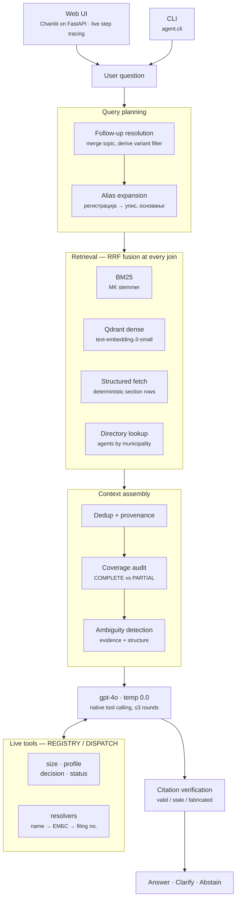

# ЦРМ Агент

**A grounded AI agent for the Central Registry of Macedonia** — answers
questions about company registration, annual accounts, pledges, certificates,
fees and deadlines in Macedonian, with a citation on every factual claim, and
executes live lookups against the registry's own services.

Hybrid retrieval over 7,759 corpus blocks, native OpenAI tool calling with six
tools, a deterministic evaluation harness, and a web UI that shows every step
the agent takes. No LangChain, no agent framework — the orchestration is ~150
lines of plain Python.

> The hard part of this domain is not retrieval volume. The *same* service has
> different correct answers depending on a variable the user rarely states:
> registering an АД is free, a Фондација costs 2,452 МКД, and the required
> documents differ across all nine legal forms. An answer that skips that
> variable is wrong in a way the reader cannot detect. Everything here exists to
> make that failure measurable, then rare.

---

## Table of Contents

- [Architecture](#architecture)
- [Core features](#core-features)
- [Live tools](#live-tools)
- [Web UI](#web-ui)
- [Measured results](#measured-results)
- [Quick start](#quick-start)
- [Repository layout](#repository-layout)
- [Evaluation harness](#evaluation-harness)
- [Tech stack](#tech-stack)
- [Known limitations](#known-limitations)

---

## Architecture


```mermaid
flowchart TB
    UI["Web UI<br/><small>Chainlit on FastAPI · live step tracing</small>"] --> Q
    CLI["CLI<br/><small>agent.cli</small>"] --> Q
    Q["User question"] --> PLAN

    subgraph PLAN ["Query planning"]
        direction TB
        FU["Follow-up resolution<br/><small>merge topic, derive variant filter</small>"]
        AL["Alias expansion<br/><small>регистрација → упис, основање</small>"]
        FU --> AL
    end

    PLAN --> RET

    subgraph RET ["Retrieval — RRF fusion at every join"]
        direction LR
        BM["BM25<br/><small>MK stemmer</small>"]
        DE["Qdrant dense<br/><small>text-embedding-3-small</small>"]
        SF["Structured fetch<br/><small>deterministic section rows</small>"]
        DL["Directory lookup<br/><small>agents by municipality</small>"]
    end

    RET --> CTX

    subgraph CTX ["Context assembly"]
        direction TB
        DD["Dedup + provenance"]
        CV["Coverage audit<br/><small>COMPLETE vs PARTIAL</small>"]
        AM["Ambiguity detection<br/><small>evidence + structure</small>"]
        DD --> CV --> AM
    end

    CTX --> LLM["gpt-4o · temp 0.0<br/><small>native tool calling, ≤3 rounds</small>"]
    LLM <--> TOOLS

    subgraph TOOLS ["Live tools — REGISTRY / DISPATCH"]
        direction LR
        T1["size · profile<br/>decision · status"]
        T2["resolvers<br/><small>name → ЕМБС → filing no.</small>"]
    end

    LLM --> VER["Citation verification<br/><small>valid / stale / fabricated</small>"]
    VER --> A["Answer · Clarify · Abstain"]
```

Every layer implements one interface — `search(query, k, filters)` — so any of
them can be switched off and scored against the same gold set.

---

## Core features

**Hybrid retrieval with Reciprocal Rank Fusion.** BM25 over a Macedonian stemmer
fused with dense cosine search. RRF rather than score blending, because the two
scores are not comparable — ranks are:

```
score(d) = w_lex / (K + rank_lex(d)) + w_vec / (K + rank_vec(d))      K = 60
```

Each arm runs to depth 50, so a document ranked ~30 by one arm is still
rescuable by the other. The stemmer is load-bearing: Macedonian suffixes its
definite articles (`куќа → куќата → куќите`), and disabling it regresses six
retrieval families.

**Semantic alias layer.** Citizens and the registry use different words — users
say `машина` (0 corpus hits) where the registry says `подвижни предмети` (430),
`гасење` (0) for `бришење` (1,081). Abbreviations are parsed from the registry's
own glossary blocks and stay current on rebuild; the rest are curated and
justified by counting both words. Expansion **fuses** rather than replaces:
replacement was measured, lifted the family it targeted, regressed seven others,
and was rejected.

**Disambiguation that fires before the model sees anything.** Two deterministic
detectors — one evidence-based, one reading the corpus schema for sibling
variants whose section *differs even when retrieval surfaced none of them*. The
second is the one that matters: on a bare *"Колку чини регистрација?"* retrieval
returns zero tariff rows, because the word matches blocks about registering a
user account. Four guards keep it from over-firing, each tested in both
directions.

**Structured section fetching.** Semantic search cannot rank
`Број на чекор: 4 | ЦРРСМ врши обработка…` for *"како да регистрирам залог"* —
they share no vocabulary. Once the service is known (routing sits at
`service_acc@1 ≈ 1.00`) the rows are a lookup, not a search, and get fused in. A
**coverage audit** then counts list-shaped sections against the corpus and tells
the model what it actually holds:

```
process (Упис на залог): 6 of 6 rows -- COMPLETE
documents (Упис на залог): 1 of 6 rows -- PARTIAL -- 5 row(s) are not here
```

This exists because the most dangerous output this system ever produced was not
a hallucination: it was a fully-cited four-step procedure for a process the
registry defines in **six** steps. Every sentence true, every sentence sourced,
the answer still wrong.

**Strict citation verification.** Every claim carries a `chunk_id`, checked
after generation and classified **valid** / **stale** (shown earlier, not
re-retrieved) / **fabricated**. An answer with no valid citation and no
abstention marker is replaced outright. The three-way split is not pedantry — a
validator that cries wolf on correct answers teaches people to ignore it.

**Deterministic directory lookup.** 3,010 authorised agents across 60
municipalities, one block per municipality rather than per agent. `СКОПЈЕ`
expands to all ten city municipalities; oversized buckets split into parts that
state their own range and true total, so a fragment is visibly a fragment.
Ingestion is defensive by necessity: the source spreadsheets contained leaked
formulas and **`АЕРОДРОM` spelled with a Latin `M`**, which would have silently
split one municipality into two.

---

## Live tools

Six tools, registered through a plain `REGISTRY` / `DISPATCH` pattern. The model
sees only the OpenAI function schemas; raw HTML and images never reach it.

| tool | returns | transport |
|---|---|---|
| `check_entity_size` | size class by ЕМБС | **live** WebForms POST, deterministic parse |
| `get_entity_profile` | 11-field company profile | saved PNG → gpt-4o Vision |
| `get_registration_decision` | a published Решение, all tables verbatim | saved PNG → gpt-4o Vision |
| `get_status_info` | filing status | saved JSON/HTML → deterministic parse |
| `search_entity_profile` | name → ЕМБС | offline index |
| `search_announcements` | ЕМБС / name / date → filing number | offline index |

The two resolvers exist because the fetch tools are keyed by identifiers users
don't have. *"Дај ми ги основните податоци за ЛОРА КОМПАНИ"* chains
`search_entity_profile → get_entity_profile` inside one turn.

**Every probabilistic read is falsifiable.** A profile or decision image carries
the identifier it was fetched by; if the extracted identifier doesn't match the
request, the result is **refused**, not returned with a caveat — wrong-company
data that looks plausible is the worst outcome available. Vision transposed two
digits of a 14-digit filing number in one read out of four, so a disagreement
with the filename triggers one re-read; a disagreement that survives is rejected
and reported.

**Tool results are citable.** Each becomes a synthetic `ContextDoc` with a
`tool:` id, so live answers pass the same citation gate as corpus-backed ones.

**On the registry's protections:** the profile, decision and status endpoints sit
behind reCAPTCHA. This project does not acquire, forge or replay those tokens.
Those three tools read documents an operator saved from the portal, and report a
clean "not available offline" for anything else — including an explicit note
that the search covered the local archive, not the registry. The live transports
are written and documented, dormant, ready for an official API key.

---

## Web UI

```bash
python serve.py          # http://127.0.0.1:8000
```

A Chainlit chat interface mounted as a sub-application on FastAPI. Real-time
step tracing shows retrieval and each tool call as it happens, with inline
`[Извор N]` citations that open the exact source block — context line, full
text, raw `chunk_id`, fetch timestamp for live lookups.

The presentation layer is strictly separate: `app.py` and `ui/` contain all of
it, and **nothing under `src/` knows the UI exists**. Tracing works by injecting
wrapped `retriever` and `dispatch` objects through the same constructor
arguments the eval harness already uses.

> **Use `serve.py`, not `chainlit run`.** Chainlit's CLI calls
> `nest_asyncio.apply()` at import, which breaks anyio's loop detection on
> Python 3.14 — every static asset returns HTTP 500 and the page renders blank.
> Mounting via FastAPI never imports that module.

One backend thread owns the index and runs every turn, because the local Qdrant
store and the sqlite embedding cache are thread-affine. That makes turns
serialised by construction rather than by a lock.

---

## Measured results

**Retrieval** — 548 cases (512 synthetic + curated), graded relevance,
per-family regression gate:

| metric | value |
|---|---:|
| **ndcg@10** | **0.8135** |
| hit@10 | 0.8741 |
| mrr@10 | 0.7466 |
| `variation_acc@1` | 0.9119 |
| `sibling_confusion@10` | 0.056 |

**Answers** — 50 curated cases, **0.988** overall, with
`no_forbidden`, `numeric_groundedness`, `value_citation` and
`citation_integrity` all at **1.000**. All 11 tool-routing cases score 1.000.
A full run costs ~$1.17; a typical answered turn ~$0.02.

**Corpus** — 7,759 blocks: 112 services, 217 variations, plus 146 directory
blocks covering 3,010 agents. A full index build costs a few cents; the sqlite
vector cache means only changed blocks are ever re-embedded.

Three deterministic gates run offline with no API key and no network:

```bash
python -m agent.selftest && python -m eval.cli selftest && python -m agent.injection
```

---

## Quick start

```bash
pip install openai qdrant-client openpyxl beautifulsoup4 pydantic httpx \
            chainlit fastapi uvicorn
setx OPENAI_API_KEY "sk-..."      # PowerShell; reopen the shell afterwards
```

Build the corpus — parse, transform and validate in one step, so build and
validation cannot drift:

```bash
cd src/scraper && python build_corpus.py
```

Embed and index into a local Qdrant (incremental):

```bash
cd src && python -m index.cli build
```

Then either the web UI:

```bash
python serve.py
```

or the terminal:

```bash
python -m agent.cli
python -m agent.cli -q "Кои се овластените регистрациони агенти во Гостивар?"
```

---

## Repository layout

```
app.py                  Chainlit handlers
serve.py                FastAPI mount + uvicorn  ← the entry point
ui/                     Presentation only; imports src/, never the reverse
├── backend.py              singletons, backend thread, agent factory
├── tracing.py              wrappers that emit Chainlit steps
└── render.py               Answer → markdown, citations, footer

src/
├── scraper/            Acquisition + transform
│   ├── fetch_services.py      archival fetch with retry
│   ├── payload_guard.py       rejects WAF pages / truncated JSON
│   ├── crm_parser.py          {Columns,Data} decoder, HTML→text, variant merge
│   ├── agents_parser.py       .xlsx agent lists → municipality blocks
│   └── build_corpus.py        single entry point: build + validate
│
├── index/              Retrieval
│   ├── embedder.py            OpenAI embeddings, sqlite cache, batching, backoff
│   ├── qdrant_indexer.py      payload mapping, incremental upsert, manifest
│   ├── hybrid.py              BM25 ⊕ dense via RRF
│   ├── aliases.py             vocabulary bridging, fusion-based expansion
│   └── structured.py          deterministic section + directory fetch
│
├── eval/               Measurement
│   ├── goldset.py             synthetic case generation, gold validation
│   ├── curated.py             hand-authored cases as self-healing rules
│   ├── answers.py             answer-level scorers
│   ├── harness.py             scoring, slicing, regression gate
│   └── cli.py                 gen · run · report · compare · answer · selftest
│
└── agent/              Answering
    ├── context.py             dedup, coverage audit, ambiguity, citations
    ├── prompts.py             system prompt (EN rules, MK output)
    ├── agent.py               orchestration, tool loop, multi-turn clarification
    ├── selftest.py            offline gate
    ├── injection.py           prompt-injection gate
    └── tools/                 the six live tools
        ├── __init__.py            REGISTRY + DISPATCH
        ├── vision.py              shared gpt-4o vision extraction
        ├── fixtures.py            recorded responses, so gates never hit the portal
        └── …                      one module per form + resolvers
```

---

## Evaluation harness

Retriever-agnostic by design — built *before* the index, because the index is a
choice and the measurement is not. Integrating a new retrieval stack is one
function:

```python
def build(corpus):
    return MyRetriever(corpus)   # .name + .search(query, k) -> [chunk_id | Hit]
```

```bash
python -m eval.cli run --retriever index.my_retriever:build --baseline eval/reports/post-form2.json
```

Exits non-zero on any regression beyond tolerance — **overall or per family**.
Per-family is the point: a change that lifts the easy families while destroying
`variation_documents` is a net loss the overall mean hides.

Two tiers of gold: **synthetic (512)**, generated from the corpus as a
regression signal rather than a quality measure, and **curated (50)**, real
phrasing stored as *rules* (service + variant + section type) rather than frozen
ids, so a corpus rebuild re-resolves them instead of letting them rot.

Answer generation and scoring are separate steps — answers are persisted, so
re-scoring after a rule change costs nothing. Tool calls replay from recorded
fixtures by default; `--live-tools` hits the real portal.

---

## Tech stack

| | |
|---|---|
| **Language** | Python 3.14 |
| **Generation** | OpenAI `gpt-4o`, `temperature=0.0`, native tool calling |
| **Vision** | `gpt-4o` structured outputs (strict JSON schema) |
| **Embeddings** | OpenAI `text-embedding-3-small` (1,536-d, cosine) |
| **Vector store** | Qdrant (embedded local mode; server-ready payload indexes) |
| **Lexical** | Custom BM25 + Macedonian stemmer — pure stdlib |
| **Validation** | Pydantic (strict tagged-union corpus schema) |
| **Web** | Chainlit on FastAPI / uvicorn |
| **HTTP** | httpx |
| **Evaluation** | Custom harness — pure stdlib, zero test dependencies |

The evaluation harness and lexical retriever carry **no third-party
dependencies** — they run anywhere Python does, with no API key.

---

## Known limitations

Stated plainly, because a system that documents its edges is easier to trust
than one that claims none.

- **Three of the four live services run offline.** Profile, decision and status
  sit behind reCAPTCHA; those tools read operator-saved documents and say so
  when they hold nothing. Only `check_entity_size` calls the registry directly.
- **Local Qdrant takes an exclusive lock.** The UI, the indexer and the eval
  harness cannot run concurrently, and turns are serialised within the UI.
- **Vision is the one non-deterministic step.** Mitigated by identifier
  self-checks, shape checks and a re-read on mismatch — not eliminated. An
  official data feed would remove it entirely; the source interface is already
  shaped for that swap.
- **The curated set is 50 cases.** Broad, not deep. One case moves a family
  average noticeably.
- **Some tariffs are published as `0`** by the registry itself. The system
  reports the row verbatim and declines to interpret it as "free".

---

## What's next

An official open-data API would delete the Vision layer entirely: the tool
contracts, the agent loop, the citation gate and the eval suite stay as they
are, and only the source objects behind each tool change. The seams are already
in place.

---

<div align="center">

*Built for a domain where a confidently wrong answer costs more than no answer.*

</div>
